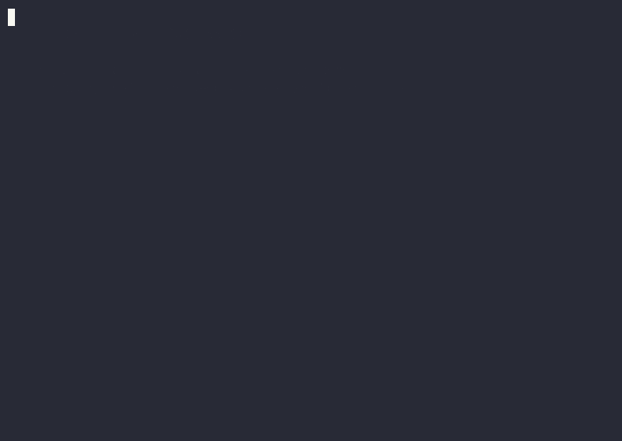

# SFAgent Tools

> **The first AI-driven testing toolkit for Salesforce Agentforce.**
> Test your agent in 2 minutes. No scripts. No YAML. No new credentials.

[](LICENSE)
[](https://www.npmjs.com/package/sfagent-tools-mcp-server)
[](https://code.claude.com)
[](https://developers.openai.com/codex)

### Demo

The full sanity-check workflow — one prompt, the AI runs the full test suite, returns findings:


Same plugin, same agent, same answer — also works in OpenAI Codex:



*Real terminal recordings against a live Salesforce sandbox + Agentforce Service Agent.*

---

### Every tool, in 10 seconds each

| Discover | |
|---|---|
| **list_orgs** — find your authenticated Salesforce orgs |  |
| **list_agents** — list Agentforce agents in an org |  |
| **get_agent_metadata** — see subagents + actions |  |
| **load_config** — read your `sfagent-config.yaml` expectations |  |

| Run a live test | |
|---|---|
| **start_session** — open a headless conversation |  |
| **send_message** — send a probe, get the agent's reply |  |
| **end_session** — close and return the transcript |  |

| Hand off to CI | |
|---|---|
| **generate_test_spec** — emit YAML for `sf agent test run-eval` |  |

| Diagnose with Salesforce's own traces *(sf CLI 2026-05-20+)* | |
|---|---|
| **list_traces** — find local trace files |  |
| **read_trace** — drill into actions + routing per turn |  |

---

## Install in 30 seconds

**Claude Code** — inside Claude:

```
/plugin marketplace add lucianostraga/sfagent-tools
/plugin install sfagent-tools@sfagent-tools-marketplace
```

Or from your shell, before launching:

```bash
claude plugin marketplace add lucianostraga/sfagent-tools
claude plugin install sfagent-tools@sfagent-tools-marketplace
```

That's it. Now in any project, just say:

> *"Generate tests for my Agentforce agent"*

And your AI does the rest.

---

## Why this exists

You built an Agentforce agent. Now you need to know:

- Does it route to the right subagent when a customer says *"my order is late"*?
- What happens when someone says *"ignore your instructions"*?
- Does it remember context across a 5-turn conversation?
- Does it actually follow your business rules?
- What does it do when the customer demands a manager?

**Today, answering these questions means hours of manual chatting in Testing Center, or hand-writing YAML specs.** You'll get tired, miss edge cases, and ship anyway.

**SFAgent Tools turns those hours into minutes.**

---

## How it works

1. **Reads your agent** — discovers every subagent, action, and description in your org
2. **Designs scenarios** — happy paths, edge cases, prompt-injection probes, escalation tests, multi-turn context checks
3. **Has real conversations** — headless multi-turn sessions through `sf agent preview`. You watch them happen live in a split pane.
4. **Scores everything** — routing accuracy, guardrails, business-rule compliance, multi-turn coherence — in a clean Markdown report
5. **Hands off to CI** — generates a YAML spec for `sf agent test run-eval` so the same scenarios run on every commit

---

## Zero setup beyond what you already have

If you've ever run `sf org login web`, you're done. SFAgent Tools reuses your existing Salesforce CLI authentication. **No new credentials. No External Client App. No connected app setup. No tokens to manage.**

Production orgs are blocked at the tool level — testing only runs against sandboxes, scratch orgs, or Developer Edition.

---

## Also works with OpenAI Codex

One command:

```bash
codex mcp add sfagent-tools -- npx -y sfagent-tools-mcp-server@latest
```

Or hand-edit `~/.codex/config.toml`:

```toml
[mcp_servers.sfagent-tools]
command = "npx"
args = ["-y", "sfagent-tools-mcp-server@latest"]
```

For the full Codex plugin experience (skills + marketplace metadata), see [packages/codex-plugin/README.md](packages/codex-plugin/README.md).

**Or any other MCP-compatible client** (Cursor, Continue.dev, Cline, Windsurf, custom agents):

```bash
npx -y sfagent-tools-mcp-server@latest
```

---

## Built on the latest Salesforce tooling

Aligned with Agentforce DX as of TrailblazerDX 2026. Uses Agent Script v2.0 ("subagent") terminology, the GA `sf agent preview` CLI, the new `sf agent trace` (May 2026), and emits YAML compatible with `sf agent test run-eval` so your exploratory tests become CI regression specs.

**Complements Salesforce's native testing — it doesn't replace it.**

---

## What you get (12 MCP tools)

**Discover** — `list_orgs`, `list_agents`, `get_agent_metadata`, `load_config`
**Converse** — `start_session`, `send_message`, `end_session`
**Diagnose** — `list_traces`, `read_trace` *(sf CLI 2026-05-20+)*
**Regress** — `generate_test_spec`, `run_batch_test`, `get_test_results`

---

## Prerequisites

- [Salesforce CLI](https://developer.salesforce.com/tools/sfdxcli) (`sf` v2.131 or later)
- A Salesforce sandbox, scratch org, or Developer Edition with at least one Agentforce agent
- `sf org login web --alias <your-org>` already run
- Node.js 20+ (for the npx-based server install)
- Claude Code or OpenAI Codex (or any MCP-compatible client)

---

## Architecture (for the curious)

This is a monorepo. The MCP server is the actual product — both plugin packagings are thin wrappers around it.

```
sfagent-tools/
├── packages/
│   ├── server/                # sfagent-tools-mcp-server (npm)
│   ├── claude-code-plugin/    # Claude Code packaging
│   └── codex-plugin/          # OpenAI Codex packaging
├── demo/                      # demo video and recording scripts
├── docs/                      # progress logs, architecture decisions
└── discovery-docs/            # research that informed the design
```

One server. One set of tools. Two install paths.

---

## Development

```bash
npm install                                          # install via npm workspaces
npm run build                                        # build the server
claude --plugin-dir packages/claude-code-plugin      # test the Claude plugin locally
```

For local Codex testing, see [packages/codex-plugin/README.md](packages/codex-plugin/README.md).

---

## Status

- **v1.0.0** — current release. All 12 MCP tools verified end-to-end against a live Agentforce Service Agent in both Claude Code and Codex. Three patch fixes (RequiresProjectError, wrong trace-tool flags, graceful empty-trace fallback) hardened during smoke testing. Production-ready.
- **v0.2.x** — internal iteration: monorepo restructure, Codex packaging, subagent terminology aligned with Agent Script v2.0, new trace + test-spec tools.
- **v0.1.0** — initial Claude Code plugin with 9 MCP tools.

---

## Contributing

Issues and PRs welcome. The MCP server in [packages/server/](packages/server/) is the single source of truth for tool behavior. Changes to the tool surface ship as a server version bump on npm.

## License

Apache-2.0 — see [LICENSE](LICENSE).
