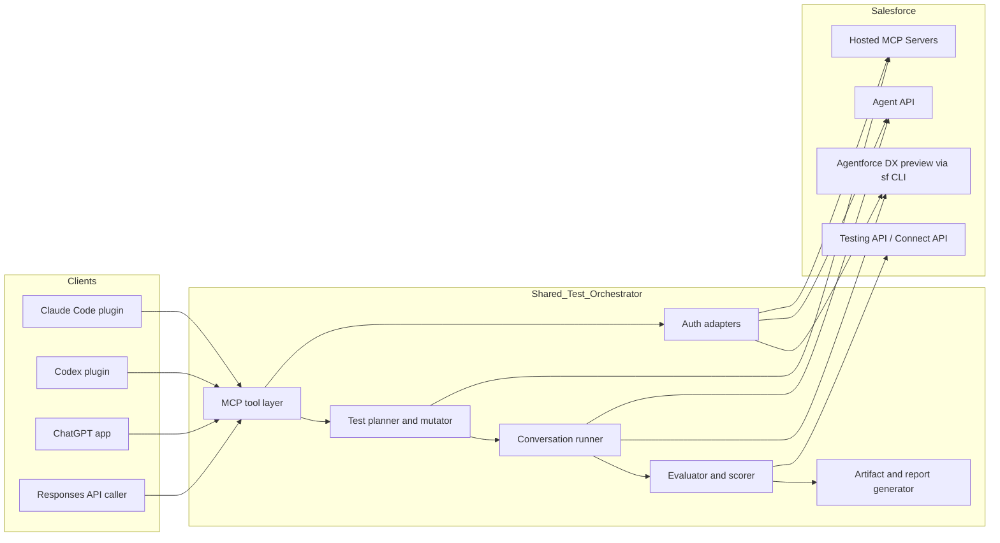
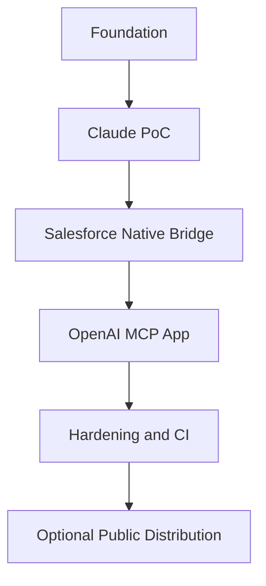

# Agentforce Testing Plugins for Claude Code and OpenAI Codex ChatGPT

## Executive summary

This is feasible, and the strongest architecture is **not** a monolithic “Salesforce-only plugin,” but a **shared testing orchestrator** that exposes a tool surface to multiple clients: a **Claude Code plugin** for Anthropic workflows, a **ChatGPT app / remote MCP server** for ChatGPT, and a **Codex plugin** for Codex. That shared orchestrator should use **Salesforce’s native testing and agent interfaces** under the hood rather than trying to replace them: **Agentforce DX preview commands** for testing drafts and unpublished authoring bundles, **Agent API** for live headless conversations with published agents, and **Testing API / Agentforce DX test commands** for regression-grade evaluations and CI outputs. This gives you additive value instead of conflicting with Salesforce’s own Testing Center, Testing API, Agentforce DX, or Hosted MCP Servers. citeturn20view3turn27view0turn20view1turn24view2turn20view4

I did **not** find an official or publicly documented off-the-shelf **Claude Code plugin** or **Codex/ChatGPT app/plugin** whose primary purpose is “automated multi-turn testing of Salesforce Agentforce agents via headless conversations, with artifact capture and generated reports.” What does exist already is a substantial adjacent stack: **Agentforce Testing Center**, **Testing API**, **Agentforce DX test and preview commands**, **Salesforce Hosted MCP Servers**, and the **Salesforce DX MCP Server**, plus third-party tools such as **Provar** for end-to-end Agentforce testing and generic LLM evaluation frameworks such as **Promptfoo**. Your idea therefore overlaps with existing tools, but it is **not redundant** if you position it as a cross-client orchestration and reporting layer over Salesforce-native primitives. citeturn44search2turn20view2turn20view3turn27view0turn20view4turn19search10turn44search3turn44search10

Two platform-specific conclusions matter most. First, **Claude Code now has a real plugin architecture**, including a manifest, skills, agents, hooks, bundled MCP servers, LSP servers, background monitors, marketplace distribution, and plugin URLs; so a Claude Code plugin is a first-class and realistic delivery vehicle. Second, on OpenAI, the extension story is **split by surface**: for **ChatGPT**, the modern extensibility path is **Apps SDK + MCP** (or **GPT Actions** for OpenAPI-based actions), while for **Codex**, there is now a formal **plugin system** with manifests, skills, MCP config, hooks, and marketplaces. Approved ChatGPT apps can also be turned into **Codex plugins** for distribution. citeturn11view0turn12view0turn13view3turn13view0turn35view1turn35view2turn35view3turn33view12

Streaming is also feasible end to end. Salesforce’s **Agent API** supports both synchronous replies and **server-sent event streaming** with chunk-level events such as **TextChunk**, **Inform**, and **EndOfTurn**. Claude’s **Agent SDK** supports partial message streaming, and Claude Code supports live plugin notifications through **monitors** and event ingestion via **channels**. OpenAI’s **Responses API** supports SSE streaming, and ChatGPT developer mode supports full MCP tool use with review/approval for writes. citeturn24view0turn24view1turn16view0turn12view0turn10view4turn33view5turn37view3

The most important design recommendation is to build a **single TypeScript-based orchestration core** and adapt it to each client surface, rather than writing separate business logic for Anthropic and OpenAI. The core should support three execution modes: **preview mode** using `sf agent preview` for drafts and unpublished authoring bundles, **live mode** using Agent API for activated agents, and **native regression mode** by compiling scenarios into **Agentforce DX / Testing API** artifacts so you can reuse Salesforce’s own evaluators and CI outputs. That design is additive, auditable, and most likely to survive vendor changes. This is an inference from the documented capabilities and gaps across the three ecosystems. citeturn27view0turn20view1turn24view2turn20view3turn35view6

## Existing landscape and overlap

Salesforce already provides a serious native testing stack. **Testing Center** is the low-code UI for scenario generation and evaluation; **Testing API** is the REST layer for batch testing; **Agentforce DX** is the pro-code path that generates YAML test specs, creates tests in the org, runs them, returns human-readable / JSON / TAP / JUnit-style results, and supports CI workflows; and **Agentforce DX preview** supports conversational previewing and even programmatic preview sessions for agents. This means your idea lives in a crowded but still open space: the missing piece is not “a way to test agents at all,” but a **developer-assistant-native orchestration layer** that can drive, expand, mutate, stream, and document complex multi-turn evaluations from within Claude Code or OpenAI tooling. citeturn44search2turn20view2turn26view0turn26view1turn26view2turn27view0

Salesforce also has two MCP-related products that matter for overlap analysis, but neither fully solves your use case. **Salesforce Hosted MCP Servers** are about exposing Salesforce data, automation, prompts, flows, invocable actions, and API Catalog endpoints to MCP-compatible clients such as Claude, ChatGPT, Cursor, or custom agents, using **per-user OAuth** and Salesforce security controls. Separately, the **Salesforce DX MCP Server** is a developer-assistant integration for standard DX tasks, and Salesforce documents that it includes **over 60 tools** and can run **agent tests**. These are powerful building blocks, but the docs position them as **integration surfaces**, not as a packaged “multi-turn headless agent QA harness with transcript artifacts and synthesized documentation.” citeturn20view4turn29view7turn29view2turn19search10

The third-party landscape is partial rather than complete. **Provar** publicly positions its product as complementary to Salesforce’s Testing Center for end-to-end Agentforce testing, especially across integrated systems. Generic LLM evaluation tools such as **Promptfoo** are clearly relevant for security and rubric-driven agent evaluation, but they are not Salesforce-native. UI frameworks based on **Playwright** exist for Salesforce testing, but they primarily automate Salesforce UI and API workflows rather than directly exercising Agentforce’s headless conversational interfaces. citeturn44search3turn44search10turn44search0

The practical overlap assessment is summarized below.

| Existing option | What it already covers | What it does **not** fully cover | Overlap with your idea | Sources |
|---|---|---|---|---|
| Agentforce Testing Center | UI-based scenario generation and evaluation, response quality, subagent/action/knowledge evaluation | Developer-assistant-native orchestration, custom long-form reporting, cross-client packaging | High | citeturn44search2turn20view2 |
| Testing API | Programmatic batch test execution and detailed results retrieval | Exploratory headless conversations, draft preview orchestration, assistant-native workflow | High | citeturn20view2turn24view2 |
| Agentforce DX | YAML spec generation, test create/run/results, CI-friendly outputs | Cross-LLM plugin UX, automated scenario expansion, narrative findings docs | High | citeturn20view3turn26view0turn26view2 |
| Agent preview CLI | Interactive and programmatic preview sessions, traces, transcripts, simulated/live modes | Packaged Claude/Codex/ChatGPT extension and higher-level eval orchestration | Very high | citeturn27view0 |
| Salesforce Hosted MCP Servers | Secure, governed MCP access to Salesforce data/automation for Claude/ChatGPT/etc. | Direct Agent API testing harness, multi-turn eval logic, native QA artifact synthesis | Medium | citeturn20view4turn29view5turn29view7 |
| Salesforce DX MCP Server | DX-oriented natural-language tooling, including agent tests | Turnkey multi-turn agent-conversation QA product | Medium | citeturn19search10 |
| Provar | End-to-end Agentforce/Salesforce/integrated-system testing | Native headless agent API/testing orchestration inside Claude/Codex | Medium | citeturn44search3 |
| Promptfoo / generic eval tools | Rubrics, agent security checks, CI eval patterns | Salesforce-native auth/org/Agentforce primitives | Medium | citeturn44search10 |

The commercial and strategic implication is favorable: **the product already exists in pieces, but not in the combined form you described**. If you build this, the strongest value proposition is “**one testing harness, multiple AI developer clients, reusing Salesforce-native evaluation surfaces and traces**,” not “yet another Salesforce test runner.” citeturn20view2turn20view3turn27view0turn20view4

## Claude Code feasibility

A Claude Code implementation is technically viable because Claude Code now supports **formal plugins** rather than only ad hoc local commands. A plugin uses a manifest at `.claude-plugin/plugin.json`, can be loaded locally with `--plugin-dir`, can be distributed through marketplaces, and can include **skills**, **custom agents**, **hooks**, **bundled MCP servers** via `.mcp.json`, **LSP servers**, **background monitors**, plugin-local executables in `bin/`, and default `settings.json`. Anthropic explicitly documents plugins as the way to share reusable capabilities across teams and communities. citeturn11view0turn12view0turn13view3turn10view2

That architecture is a very good fit for your problem. The **plugin skill** can be the user-facing entry point, for example `/agentforce-test:run-suite`, `/agentforce-test:preview`, or `/agentforce-test:generate-report`. The skill can instruct Claude how to interpret repo-local files such as YAML plans, Markdown scenario notes, or target-agent descriptors. The **bundled MCP server** can implement the operational tools: list agents, start preview sessions, send utterances, stream chunks, end sessions, compile tests into Salesforce-native specs, run regression tests, and fetch artifacts. The **hooks** can capture outputs, normalize logs, and post-process result trees. The **background monitor** can tail run-state files or event logs and deliver each line to Claude as a notification while a run progresses. citeturn11view0turn12view0turn10view3

Claude Code also has the right streaming-adjacent primitives. Anthropic’s **Agent SDK** supports incremental partial messages by enabling `include_partial_messages` / `includePartialMessages`. Claude Code **monitors** automatically stream stdout lines from background commands into the active session as notifications, and **channels** can push events or even two-way messages into a running Claude Code session from an MCP server. Channels are still in research preview and only deliver while the session is open, but for a testing plugin they are enough to surface live “conversation chunk,” “assertion failed,” or “report generated” events without waiting for the full run to finish. citeturn16view0turn12view0turn10view4

Claude Code can also integrate with Salesforce cleanly through local executables. A plugin can place executables in `bin/`, and plugin or agent workflows can use shell commands. That makes it straightforward to call **Salesforce CLI** for org selection, draft preview, native test generation, deployment, or result retrieval, while keeping Salesforce’s auth state as the source of truth instead of duplicating auth logic in your plugin. This is the cleanest way to stay “friendly with Salesforce existing products.” citeturn12view0turn20view3turn27view0

The biggest caveat is trust. Anthropic warns that plugins and marketplaces are **highly trusted** and can execute arbitrary code with the user’s privileges. That is acceptable for an internal engineering plugin, but it means you should treat your plugin like an internal developer tool with conventional software supply-chain controls: signed releases, pinned versions, minimal shelling, no secret exfiltration, and clear documentation of every filesystem, network, and CLI interaction. citeturn13view0turn13view1

## OpenAI Codex and ChatGPT feasibility

On OpenAI, you should think in terms of **three extension surfaces**, not one. For **ChatGPT**, the modern extension surface is **Apps SDK + MCP**, optionally combined with a widget UI in ChatGPT. For **Codex**, there is now a dedicated **plugin system** with manifests, skills, hooks, apps, and MCP server configuration. For programmatic execution outside ChatGPT/Codex UX, there is the **Responses API**, which can call **remote MCP servers** and stream results. OpenAI’s own docs now describe Apps SDK as the framework for ChatGPT apps, say approved apps become **Codex plugins** for distribution, and document a formal Codex plugin packaging model. citeturn35view5turn33view1turn35view3turn35view1turn35view0

That means an “equivalent plugin for Codex ChatGPT” is absolutely possible, but the shape differs by product:

- In **ChatGPT**, the equivalent is an **app** backed by an **MCP server**. The app can be tested privately in **developer mode** and, if submitted and approved, listed publicly. Developer mode provides full MCP client support for read and write tools, supports **OAuth**, **no auth**, and **mixed auth**, and supports **SSE and streaming HTTP** for remote MCP servers. citeturn37view0turn37view3turn33view2
- In **Codex**, the equivalent is a **Codex plugin** with a `.codex-plugin/plugin.json` manifest. Codex plugins can bundle **skills**, **hooks**, `.mcp.json` server config, and `.app.json` connector/app mappings; they are browsable in plugin directories and installable from marketplaces. citeturn36view0turn36view1turn36view2turn36view3turn35view0
- In the **API**, the equivalent is a **remote MCP server** called through the **Responses API**, which supports streaming and can attach either a public `server_url` or an OpenAI-maintained `connector_id`. These MCP tool calls can be auto-approved or routed through an approval flow. citeturn33view4turn33view5turn41view2turn41view3turn41view0

A key design consequence follows from OpenAI’s docs: if you want a **single OpenAI-side implementation**, the durable center is the **remote MCP server**, not a legacy “plugin spec.” Your ChatGPT app and your Codex plugin should both point at the same MCP-backed testing service. That gives you one test orchestration layer for ChatGPT, Codex, and the OpenAI API. OpenAI’s own docs point developers in exactly this direction: Apps use MCP; ChatGPT developer mode connects to MCP; the Responses API supports remote MCP; and Codex supports MCP in both CLI and IDE. citeturn35view5turn33view7turn41view3turn42view0

GPT Actions remain relevant, but mostly as an alternative path, not the main one for this project. OpenAI’s help docs say a GPT can use **either apps or actions, but not both at the same time**, and actions require API details, authentication details, and an **OpenAPI schema**. If your target is a packaged developer/testing experience with richer tool metadata, live MCP tooling, and optional UI, **Apps SDK + MCP** is the better fit. Actions are more suitable if you want a simple GPT wrapper over a small REST API and do not need an MCP-native surface. citeturn33view12

OpenAI’s current distribution story is also more nuanced than “publish a plugin.” Apps SDK docs state that approved apps are the current path to public distribution, and that when an app is approved and published, **OpenAI creates the plugin for Codex distribution**; for now, plugins are available in Codex, while private or workspace-only use should stay in **developer mode**. That is useful for your roadmap because it suggests a sequence: **private ChatGPT app in developer mode first, Codex local plugin next, public submission last if needed**. citeturn35view3turn35view4turn33view1

The OpenAI file-handling story is strong on the API side. The **Responses API** accepts `input_file` items as file IDs, Base64 payloads, or external URLs, and processes PDFs, documents, code files, and spreadsheets differently. That gives you a good programmatic path for uploading test plans, rubrics, transcript fixtures, or report templates in a Codex/ChatGPT-adjacent workflow if you decide not to rely only on repo-local files. citeturn33view6

## Salesforce integration and authentication

Salesforce offers **two distinct conversation surfaces** that matter for your plugin. The first is **Agentforce DX preview**, which is ideal for **drafts and unpublished authoring bundles**. It supports **simulated mode** and **live mode**, offers both **interactive preview** and **programmatic commands** (`agent preview start`, `agent preview send`, `agent preview sessions`, `agent preview end`), saves `transcript.json` and detailed trace JSON, and explicitly says it uses **Agent API internally**. It is therefore the best testing surface for pre-publish development. citeturn27view0

The second is **Agent API**, which is the right surface for **activated, published agents** and true external “headless agent conversations.” It supports creating sessions, sending messages, streaming responses, ending sessions, passing variables, and submitting feedback. Salesforce documents that it is for connecting to agents from websites and workflows and for deploying **headless agents** without UI constraints. The session lifecycle uses discrete endpoints, and the streaming endpoint returns events over **SSE**, including progress, text chunks, full messages, and end-of-turn events. citeturn20view0turn20view1turn24view0turn24view1turn24view3

The **Testing API** and **Agentforce DX test commands** are the third pillar. Use them when you want stable regression semantics instead of exploratory multi-turn chat. Agentforce DX can generate a YAML **test spec**, create an `AiEvaluationDefinition`, run tests asynchronously or synchronously, output human-readable or **JSON/TAP/JUnit** results, and include **metrics**, **custom evaluations**, **generated JSON**, and even **conversation history** for multi-turn cases. This means your plugin does not need to invent a parallel regression framework; it can compile higher-level scenarios down to Salesforce-native artifacts and use Salesforce’s own evaluators when appropriate. citeturn26view0turn26view1turn26view2turn26view3

Salesforce auth is the one place where you should **not** over-unify. Different Salesforce surfaces expect different auth approaches.

For **Salesforce CLI / Agentforce DX**, the standard local interactive path is `sf org login web --alias my-org`, optionally setting a default org. Salesforce’s docs also document **JWT flow** for CI-style authorization with `sf org login jwt`, and **SFDX auth URL** login for non-interactive environments with `sf org login sfdx-url --sfdx-url-file authFile.json`. Salesforce further documents that if you authorize with `org login web` and use the default connected app, its refresh and access tokens are configured too permissively by default, and recommends tightening those policies. citeturn21search0turn43search3turn43search10turn22search5

For **Agent API**, Salesforce documents a different setup: create an **External Client App**, enable the **client credentials flow**, issue JWT-based access tokens for named users, assign a Run As user with API access, and request scopes including `api`, `refresh_token` / `offline_access`, `chatbot_api`, and `sfap_api`. Agent API calls are not supported for agents of type **“Agentforce (Default)”**, and the API has a documented **120-second timeout**. citeturn20view1turn23search2

For **Salesforce Hosted MCP Servers**, Salesforce explicitly says you need an **External Client App**, **not** a Connected App, and that connection is via OAuth 2.0 with PKCE and per-user auth. Hosted MCP is therefore not something you should try to force through the Salesforce CLI auth model. It is a separate, standards-based client-to-server integration surface intended for MCP clients like Claude and ChatGPT. citeturn29view5turn29view6turn20view4

A practical auth strategy therefore looks like this:

| Use case | Recommended auth path | Why | Sources |
|---|---|---|---|
| Local developer preview of draft agents | `sf org login web` + Agentforce DX `agent preview` | Uses existing local org auth, zero duplicate token plumbing | citeturn21search0turn27view0 |
| CI/headless preview or DX workflows | `sf org login jwt` or `sf org login sfdx-url` | Non-interactive and CI-friendly | citeturn43search3turn43search10 |
| Live headless conversations against published agents | External Client App + Agent API token flow | This is what Agent API requires | citeturn20view1 |
| Claude/ChatGPT direct Salesforce data/tool access through MCP | Hosted MCP + External Client App + per-user OAuth | This is the intended Hosted MCP architecture | citeturn29view5turn29view6turn20view4 |

One important operational detail: Salesforce’s docs note that `sf org display --target-org ... --verbose` exposes sensitive session information, including access-token-level material, and should be treated as privileged output. If your plugin shells out to CLI commands, capture and scrub this output carefully and never dump it into report artifacts. citeturn43search7

## Proposed designs

The most robust solution is a **shared orchestration backend** with two thin client-specific packaging layers.

The backend should expose a small set of capabilities: discover org/agents, choose execution mode, start a run, send utterances, stream events, capture transcripts and traces, compile native tests, run native tests, fetch artifacts, and generate reports. Claude Code and Codex would consume that same backend through MCP tools plus client-specific skills and hooks. ChatGPT would consume the same backend either through a private developer-mode app or a submitted app. This design aligns with the way Claude plugins, ChatGPT apps, Codex plugins, and the Responses API are all documented today. citeturn12view0turn35view5turn35view1turn41view3



A **Claude Code plugin** should bundle four things. First, one or more **skills** that tell Claude how to interpret test-plan files and when to invoke the testing tools. Second, an `.mcp.json` file that launches a **local stdio MCP server** or points to a remote one. Third, **hooks** that package reports, redact secrets, and optionally fail fast on destructive scenarios. Fourth, a **monitor** that turns long-running test events into Claude notifications. This is squarely inside Claude Code’s documented plugin model. citeturn11view0turn12view0turn10view3

A **ChatGPT / Codex implementation** should center on a **remote MCP server**. For ChatGPT, the MCP server becomes an **app** in developer mode and later a reviewed public app if desired. For Codex, you can either connect the same MCP server directly via `codex mcp` or package it as a **Codex plugin** with skills and hooks. OpenAI explicitly documents Codex plugin manifests, bundled MCP config, hooks, and marketplace distribution, while Apps SDK defines the ChatGPT app side. citeturn37view3turn42view0turn42view2turn35view1turn35view5

### Recommended tool surface

Whether you expose this via a Claude plugin MCP server or an OpenAI app MCP server, I would keep the first tool surface deliberately small:

- `list_org_context`
- `list_agent_targets`
- `start_preview_run`
- `start_live_run`
- `send_turn`
- `stream_run_events`
- `end_run`
- `compile_native_agentforce_tests`
- `run_native_agentforce_tests`
- `get_artifact`
- `generate_markdown_report`
- `export_junit`

That shape matches documented guidance from Apps SDK to design **one job per tool** with explicit schemas, and it also helps ChatGPT developer mode and Codex choose tools more reliably. citeturn35view6turn37view3

### Suggested file formats

A repo-first design is the simplest for Claude Code and Codex, because both are developer-centric local tools and Salesforce DX already uses YAML for native test specs. I would use three human-editable files.

**Target definition**

```yaml
# agent-target.yaml
org:
  alias: my-sandbox
mode:
  default: preview   # preview | live | native-regression
agent:
  apiName: Resort_Manager
  authoringBundle: resort_manager
live:
  myDomainUrl: some_domain.my.salesforce.com
  agentId: 0Xx...
variables:
  "$Context.EndUserLanguage": en-US
  customerTier: gold
```

**Scenario plan**

```yaml
# test-plan.yaml
suite: booking-regression
goals:
  - validate routing to the correct subagent
  - verify required actions are invoked
  - verify the final answer matches policy and business rules
cases:
  - id: change-booking
    utterance: "I need to reschedule my booking from Friday to next Monday."
    expectedSubagent: Booking_Changes
    expectedActions:
      - Lookup_Booking
      - Find_Availability
    expectedOutcome: >
      The agent should confirm the current booking, present a valid Monday option,
      and ask for confirmation before changing anything.
  - id: multi-turn-refund
    conversationHistory:
      - role: user
        message: "I want a refund for my order."
      - role: agent
        subagent: Returns
        message: "I can help with that. What is your order ID?"
    utterance: "It’s 884312."
    expectedSubagent: Returns
    customChecks:
      - label: order-id-was-passed
        jsonPath: "$.actions[?(@.name=='Lookup_Order')].input.orderId"
        operator: equals
        expected: "884312"
metrics:
  - latency
  - quality
  - grounding
```

**Evaluation rubric**

```yaml
# rubric.yaml
policy:
  forbid_destructive_actions_without_confirmation: true
  require_citation_when_knowledge_used: true
scoring:
  pass_threshold: 0.85
weights:
  subagent: 0.25
  action: 0.25
  outcome: 0.35
  latency: 0.15
outputs:
  markdown: true
  json: true
  junit: true
```

These are intentionally close to Salesforce’s own **Agentforce DX test spec** model, which already supports utterances, expected subagent selection, metrics, **custom evaluations**, and **conversation history**. The benefit of staying close to the native spec is that your tool can transpile many cases directly into Salesforce-native tests whenever stable regression is more appropriate than exploratory chat. citeturn26view0turn26view3

### Mode selection

Your orchestrator should choose the Salesforce execution surface based on target maturity:

| Mode | Best for | Salesforce surface | Why | Sources |
|---|---|---|---|---|
| Preview | Drafts, unpublished authoring bundles, local iteration | `sf agent preview start/send/end` | Supports simulated/live preview, traces, transcripts, programmatic control | citeturn27view0 |
| Live | Published headless agents in realistic conditions | Agent API | Native session lifecycle, variables, SSE streaming | citeturn20view1turn24view0turn24view1turn24view3 |
| Native regression | Repeatable CI gates and formal result outputs | Testing API / Agentforce DX | Salesforce-native evaluators and result formats | citeturn24view2turn26view2 |

### Streaming design

For Salesforce-originated streaming, use **Agent API SSE** whenever you are in live mode. In preview mode, wrap `agent preview send` or its trace outputs as a synthetic event stream. In Claude Code, route these updates through **monitors** or **channels**. In OpenAI, surface them either inside the ChatGPT app UI or through **Responses API** streaming if you are running the workflow programmatically. Salesforce, Anthropic, and OpenAI all document streaming-capable primitives here; what you need to add is the **adapter layer** that normalizes them into one run-event schema. citeturn24view1turn10view4turn12view0turn33view5

A simple normalized event schema would look like this:

```json
{
  "runId": "run_123",
  "timestamp": "2026-05-23T18:15:02Z",
  "type": "text_chunk",
  "caseId": "multi-turn-refund",
  "source": "salesforce-agent-api",
  "payload": {
    "text": "I found your order..."
  }
}
```

That schema is your biggest long-term portability win, because it decouples the reporting engine from vendor-specific formats.

## Limitations, security, compliance, and roadmap

Some limitations are hard product constraints. **Agent API** is not supported for agents of type **Agentforce (Default)**, and it has a documented **120-second timeout**. **Agent preview** does not strictly adhere to endpoint configuration and explicitly does **not** support escalation testing; Salesforce recommends testing escalation only after publishing via the intended endpoint. **Testing Center** and test runs consume Salesforce **requests and credits**. These are not implementation bugs; they are platform realities your plugin must expose clearly in its docs and UI. citeturn20view1turn23search2turn27view0turn44search2

The largest security concerns come from **MCP** and from **plugin trust**. Anthropic warns that Claude Code plugins can execute arbitrary code on the user’s machine. OpenAI warns that ChatGPT developer mode is “powerful but dangerous,” and that remote MCP servers can exfiltrate anything that enters model context. The MCP spec and both vendors’ docs emphasize OAuth-based authorization, careful server trust, and prompt-injection awareness. If you connect external tools or allow write actions, you should default to **read-only where possible**, require explicit approval for writes, and prefer **official** or self-hosted remote servers over third-party proxy servers. citeturn13view0turn37view3turn41view3turn30search1turn29view2

For Salesforce data governance, keep two principles. First, prefer **sandbox/scratch orgs** and **preview simulated mode** during early development. Second, if you use Hosted MCP or any runtime data access, choose the least-privileged server surface you need: for example, **`platform/sobject-reads`** rather than **`platform/sobject-all`**, or a **Named Query / InvocableMethod-backed custom server** rather than broad CRUD access. Salesforce’s Hosted MCP docs are explicit that per-user auth and field/object/sharing rules apply, and that scoping server capabilities is part of the security model. citeturn29view4turn29view3turn29view2turn29view7

On the OpenAI side, app submission and public deployment create additional compliance overhead. Submitted apps need organization verification, publicly accessible MCP endpoints, CSP configuration, legal URLs, screenshots, test prompts/responses, and review. For private internal use, OpenAI explicitly recommends **developer mode** instead of public submission. That makes internal rollout much easier than productized public rollout. citeturn35view3turn33view2

### Recommended roadmap

The effort estimates below are my own implementation estimates based on the documented surfaces and their complexity.



| Milestone | Scope | Estimated effort |
|---|---|---|
| Foundation | Shared TypeScript orchestration core, normalized event schema, artifact model | 1–2 weeks |
| Claude PoC | Claude Code plugin with skills + local MCP server + preview-mode runs via `sf agent preview` | 2–3 weeks |
| Salesforce native bridge | Native regression export to Agentforce DX / Testing API, Markdown + JSON + JUnit reports | 2–3 weeks |
| OpenAI MVP | Remote MCP server, private ChatGPT developer-mode app, Codex local plugin packaging | 2–4 weeks |
| Hardening | Secret scrubbing, write-approval defaults, retry policies, redaction, CI integration | 2–3 weeks |
| Optional public distribution | OpenAI app submission, Codex plugin directory readiness, Anthropic marketplace packaging if desired | 1–3 weeks |

### Recommended tech stack

I recommend **TypeScript** as the primary language for the shared orchestrator. It aligns well with **OpenAI Apps SDK**, remote MCP server patterns, SSE handling, JSON Schema / Zod tool definitions, and cross-platform shell orchestration. If you later want deeper statistical evaluation or notebook-style analysis, add a small Python sidecar for evaluators, but keep the transport and packaging core in TypeScript. This is a recommendation rather than a vendor-documented requirement.

### Prioritized action items

| Priority | Action | Why |
|---|---|---|
| Highest | Build **preview-mode** first using `sf agent preview start/send/end` | It works on drafts and yields transcripts/traces immediately, which is the fastest proof of value |
| High | Keep your scenario format close to **Agentforce DX YAML** | You gain a bridge to native tests and CI outputs instead of inventing a parallel testing DSL |
| High | Use **Salesforce CLI auth** only for DX/preview workflows, and **External Client App auth** for Agent API / Hosted MCP | This avoids fighting the intended auth models |
| High | Implement a **shared MCP server core** and adapt clients around it | Lowest long-term maintenance across Claude, Codex, ChatGPT, and API usage |
| Medium | Add **write-approval** and **least-privilege server mode** from day one | Required for safe use with real Salesforce data and actions |
| Medium | Position the product as **orchestration over native Salesforce testing**, not replacement | This avoids overlap confusion and strengthens enterprise acceptability |

## Primary sources

The highest-value primary sources for implementation are the following:

**Anthropic / Claude**
- Claude Code plugin creation, structure, distribution, hooks, monitors, and marketplaces. citeturn11view0turn12view0turn10view2turn13view0
- Claude Code channels for pushing live events into a running session. citeturn10view4
- Claude Agent SDK streaming and custom tools / MCP integration. citeturn16view0turn16view1turn16view2

**Salesforce**
- Agent API overview and get-started docs for headless agents, sessions, variables, and streaming. citeturn20view0turn20view1turn24view0turn24view1turn24view3
- Testing API and Agentforce DX testing docs, including test spec generation, custom evaluations, conversation history, and outputs. citeturn20view2turn20view3turn26view0turn26view1turn26view2turn26view3
- Agentforce DX preview docs for simulated/live/programmatic preview and transcript/trace export. citeturn27view0
- Hosted MCP Servers overview, client connection flow, Claude/ChatGPT setup, server reference, and best practices. citeturn20view4turn29view5turn29view1turn29view0turn29view7turn29view2
- Salesforce CLI auth docs for browser login, JWT flow, SFDX auth URL, and connected/external client apps. citeturn21search0turn43search3turn43search10turn22search5turn43search11turn43search12

**OpenAI**
- Apps SDK overview, quickstart, auth, submission, and ChatGPT connection flow. citeturn33view1turn35view5turn40view0turn40view3turn35view3turn33view2
- ChatGPT developer mode and full MCP support for read/write tools. citeturn37view0turn37view3
- Responses API overview, streaming, file inputs, and MCP/connectors guide. citeturn33view4turn33view5turn33view6turn41view2turn41view3
- Codex CLI, Codex MCP support, Codex plugins, and plugin build docs. citeturn33view9turn42view0turn35view0turn35view1turn36view0turn36view3
- GPT Actions help docs for the action-based alternative and the “apps or actions, not both” limitation. citeturn33view12

**MCP specification**
- MCP architecture and authorization specifications, including OAuth 2.1 expectations. citeturn30search0turn30search1turn30search3turn30search6

## Open questions and limitations

A few implementation questions remain open because they depend on your org and product choices rather than public docs alone.

The first is whether your target agents are mostly **draft authoring bundles**, mostly **published headless agents**, or both. That determines how much of the first release should lean on **Agentforce DX preview** versus **Agent API**. Salesforce supports both, but they serve different lifecycle stages. citeturn27view0turn20view1

The second is where you want to land on the **distribution spectrum**. For an internal engineering tool, the fastest path is **Claude Code private plugin + private ChatGPT developer-mode app + local/private Codex plugin**. Public distribution on either Anthropic or OpenAI adds review, policy, and packaging requirements that are probably unnecessary for a first version. citeturn13view0turn35view3turn33view2

The third is how much of the evaluation logic should remain **Salesforce-native** versus **custom**. My recommendation is to keep exploratory mutation, report-writing, clustering, and failure triage custom, while delegating stable pass/fail regression checks to **Agentforce DX / Testing API** as much as possible. That balance is the most future-proof, but the exact split depends on how opinionated you want the tool to be. citeturn20view2turn26view2turn26view3